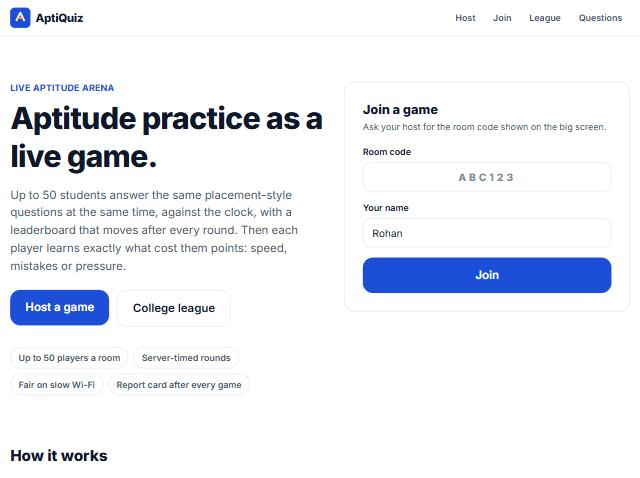
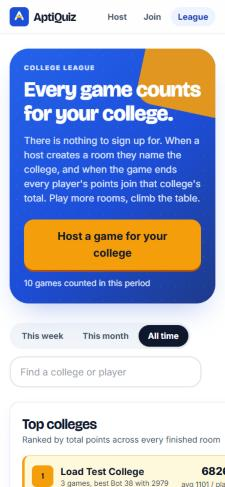

# AptiQuiz

Live multiplayer aptitude practice for placement preparation. Problem Statement 3.

Live URL: https://aptiquiz-1zfx.onrender.com

## What it does

AptiQuiz turns aptitude practice into a live game. A host creates a room from a question set and shares a 6-letter code; up to 50 students join from their phones, see each question at the same moment, answer against the clock, and watch a leaderboard move after every round. At the end, every player gets a report card that explains exactly where their points went: speed, wrong answers or pressure, topic by topic. Scores from every room feed a college league.

## Screenshots

| Home | Host lobby on the big screen |
|---|---|
|  |  |

| Projector view during a reveal | League on a phone |
|---|---|
|  |  |

| Player question | Player reveal | Player report card |
|---|---|---|
|  |  |  |

## Done / Left / Plan

**Done**
- Question authoring two ways: a plain-text quick creator on the Host page (type questions as you would on paper, "A) 30", "Answer: B") that saves the set and opens the room in one step, and a full editor with topic, difficulty, explanation, image, table, reorder, duplicate, delete, plain-text and JSON import. Nine built-in sets built from a bank of 60 questions we wrote for this project, each tagged easy, medium or hard, with a worked explanation: a demo round, a balanced mix, easy, medium and hard rounds, and one pack per topic.
- Rooms with short join codes and a QR code, a live lobby, host start. The host picks a level (mixed, easy, medium or hard) and can change the set, level, pace, exam mode and auto-advance in the lobby before starting.
- Practice mode: play any set alone at a relaxed, normal or fast pace, with the same report card at the end. Practice games are never counted in the league.
- Light theme by default, with a dark theme one tap away in the header that lasts for the browser session. Every colour comes from one token sheet, so both themes keep the same contrast rules.
- Error handling throughout: an offline screen and a long-reconnect screen with a drawn mascot, a crash page that keeps the game safe, plain-language messages when the server is unreachable or waking up, Try again on every page that loads data, and a fallback when a question image does not load.
- Live play: server-timed countdown, per-player shuffled options, answer lock-in with the measured answer time, live "answered" counter. Auto-advance by default: the server starts the next question 8 seconds after each reveal with a countdown on every screen; the host can skip ahead or pause.
- Scoring that rewards speed, with the rule shown to players; optional exam mode with negative marking.
- Animated leaderboard with movement arrows after each question, plus an answer-distribution chart on the host and projector reveal (one bar per option, counts on top, tick on the correct one); on laptops players also see a live standings panel beside the question, on phones a one-line strip that expands. Final results with podium, per-player accuracy, speed and topic strengths.
- Pressure Profile report card, framed as what to work on next: points available from speed, accuracy and unanswered questions; accuracy in the last quarter of the timer versus earlier; accuracy right after a mistake.
- Host insights: per-question correct rates, hardest questions, topic accuracy, tab-switch flags, fairness panel, CSV export.
- College league across rooms, by week, month or all time.
- Server as referee, latency compensation, reconnection with the same score, cheating resistance (details below). Our own review pass found and fixed: a seat token being lost on a request timeout, a double "next" closing a fresh question, ghost seats when one connection joined twice, an early-close timer surviving a player's return, tie-breaks that favoured skipping, late-joiner maths, and a spectator payload that carried private reports.
- 50-player simulation script, results below.
- Projector view at `/watch/CODE`: a read-only second screen that follows the game. It receives standings and question statistics, never players' private reports.
- Mobile-first layout, keyboard answering (keys 1 to 4), labelled controls, colour plus icon for every status.

**Left**
- Persist league and question sets in Postgres instead of JSON files, so data survives redeploys.
- Team battles and a daily challenge with streaks.
- Power-ups with per-game limits.
- Sound cues with an on/off toggle.

**Plan for the next 16 hours**
1. Deploy, test on three phones on venue Wi-Fi, fix anything that feels slow.
2. Postgres adapter behind `store.js`, keeping the same interface.
3. Team battles: a team field at join time and a combined-score table.
4. Final pass on accessibility (screen reader labels on the reveal) and a recorded demo as a backup.

## Architecture and why

One Node.js process is the referee. Express serves the built React client and a small REST API; Socket.IO carries the game. Game state lives in memory inside a `GameManager` (one object per room with its own timers), and finished games and question sets are flushed to JSON files through a single persistence module.

Why Node.js and Socket.IO: a 50-player room is about 50 messages per question, which Node handles in well under a millisecond; the delay players feel is the network. Socket.IO brings rooms, acknowledgements, automatic reconnection and a polling fallback for restrictive Wi-Fi, so the build time went into fairness and anti-cheat instead of plumbing.

Why in-memory state with JSON persistence: the game loop never waits on a database, and `store.js` is the only module that knows where data lives, so Postgres is a one-module swap. On Render's free tier the disk is ephemeral, so the league resets on redeploy.

Why React, Vite and Tailwind: the host screen and the phone screen share the same components at different sizes, and Framer Motion animates leaderboard reordering.

**Fairness under network delay, in plain words.** A question takes one trip to reach your phone and your tap takes one trip to come back, so your raw time includes a whole round trip of network delay. The server measures each player's round-trip time itself, with a timed probe every few seconds, and subtracts the smallest recent measurement from the answer time, capped at 400 ms. Two players who tap at the same instant on different connections therefore get the same time. Because the server measures, nobody can report a fake delay; because of the cap, deliberately slowing your probe replies buys at most 400 ms, about 10 points on a 20-second question, and it shows in the host's fairness panel.

**Cheating resistance.** Options are shuffled per player per question on the server, so copying a neighbour's letter does not help. The correct answer is never sent before the reveal; the live counter only says how many answered. The first answer is final; duplicates, stale and late answers are dropped and counted. Every socket is rate-limited, payloads are capped at 10 KB, one connection holds one seat, and a kicked player cannot rejoin under the same name or address. Host actions need the room's host token. Players who hide the tab during a question are flagged to the host. Rejoining needs the secret seat token issued at join time, and a second device with the same token replaces the first. The answer key of any set that is currently being played is hidden from the editor API until that game ends, and a college can lock the editor entirely with `HOST_PASSCODE`. Known limit of open mode: a student could read a built-in set's answers before a game starts, which is why hosts who care use their own sets or faculty mode.

**Reconnection.** Each player gets a seat token stored on the phone under the room code. On reload the client resumes with it; the server re-attaches the socket to the same player object and replies with the current state: the open question with the remaining time, the reveal, or the final report. Nobody else notices.

The full design, with the life of a round and the reasoning behind each choice, is in [ARCHITECTURE.md](ARCHITECTURE.md).

## What we added

- **Pressure Profile.** The brief says students fail aptitude tests because of speed and pressure, not ability. The report card shows where the next points will come from: faster answers, more accurate answers, or attempting every question. It also compares accuracy in the last quarter of the timer with accuracy earlier, and accuracy on the question right after a mistake, so a student learns whether the clock or the content is the thing to practice.
- **Exam mode.** Host-selected negative marking that mirrors real placement tests, with the rule shown to every player before the game.
- **Faculty insights and CSV export.** Per-question correct rates, hardest questions, topic accuracy and a one-click CSV, so a placement cell can run a league and act on the data.
- **Fairness panel.** Measured connection delays and the count of rejected late, duplicate and invalid answers, visible to the host after every game.
- **Explanations on the reveal.** Every built-in question carries a one-line explanation that appears on every screen when the answer is revealed.
- **Tab-switch flags.** The host sees who left the page during a question.
- **Projector view.** `/watch/CODE` mirrors the host screen without controls, for a second display at college events.
- **Practice mode and levels.** Solo practice with the same report card, and easy, medium and hard filters on any set, so a student can warm up alone before competing.

## How to run it

Requirements: Node.js 20 or newer.

```bash
git clone https://github.com/rohanpandey436/aptiquiz.git
cd aptiquiz
npm install
npm run build
npm start
```

Open http://localhost:3000. For development with hot reload, `npm run dev` runs the server on 3000 and Vite on 5173.

Environment variables are optional and documented in `.env.example`. `HOST_PASSCODE` is optional; when set it locks the question editor and every API call that reveals answers, with a per-address limit on wrong attempts.

Test login: none needed. Hosting, joining and the question editor are open on the demo deployment. A college can set `HOST_PASSCODE` to lock the editor ("faculty mode"); hosting a game never needs a passcode. While a set is being played, its answer key is hidden from the editor API even in open mode, so a player cannot read the answers mid-game.

Live instance: https://aptiquiz-1zfx.onrender.com (Render free tier, so the first load after a quiet spell can take up to a minute while the instance wakes).

50-player simulation:

```bash
npm run loadtest -- --url=http://localhost:3000 --players=50 --fast
```

Unit tests for the engine (`npm test`) cover shuffling, scoring, exam mode, rejection of duplicate, stale, invalid and late answers, compensation capping, early close, tie-breaks, reconnection and the report maths.

For a live demonstration, host a room on the big screen first and let the bots join it, so the lobby fills with 50 named players and the leaderboard moves with 50 entries when you press Start:

```bash
npm run loadtest -- --url=https://aptiquiz-1zfx.onrender.com --join=ROOMCODE --players=50
```

In its default mode the script creates a room, joins 50 bots, plays a full game, and checks that every bot received every question and reveal, that duplicate and late answers were rejected, that a bot which drops and resumes keeps its seat, and that the final leaderboard is complete and sorted. Latest local run:

| Measure | Result |
|---|---|
| Players joined | 50 of 50 |
| Join latency | p50 30 ms, p95 51 ms |
| Answer acknowledgement latency | p50 4 ms, p95 13 ms, max 22 ms |
| Answers accepted | 245 (5 questions, 49 honest bots) |
| Rejected on purpose | 5 duplicate, 5 late |
| Bot that dropped and resumed mid-game | kept its seat and score |
| Every bot received every question and reveal | yes |
| Final leaderboard | 50 entries, sorted correctly |

Run on 8 October 2026 against a local server (`node scripts/loadtest.js --url=http://localhost:3000 --players=50 --fast`).

The same command against the live Render instance, from a laptop in Greater Noida:

| Measure | Result |
|---|---|
| Players joined | 50 of 50 |
| Join latency | p50 517 ms, p95 701 ms |
| Answer acknowledgement latency | p50 389 ms, p95 555 ms, max 597 ms |
| Round trip measured by the server | average 270 ms, slowest 287 ms, all subtracted from answer times |
| Rejected on purpose | 5 duplicate, 5 late |
| Delivery and leaderboard checks | all passed |

Latency on the free tier is dominated by the distance to the data centre, not by the server, which is why compensation matters: without it a 270 ms round trip would cost every player about 7 points per question.

Deployment: `render.yaml` describes a single free web service (build `npm ci && npm run build`, start `npm start`). Push to `main` and Render redeploys. Free instances sleep after idle time, so the server pings its own health endpoint every 10 minutes while `RENDER_EXTERNAL_URL` (set by Render) or `KEEPALIVE_URL` is present.

## Tools and AI used

- Runtime: Node.js 24, Express 4, Socket.IO 4.
- Client: React 18, Vite 5, Tailwind CSS 4, Framer Motion, react-router, qrcode.react, socket.io-client.
- Testing: the bot simulation in `scripts/loadtest.js` built on socket.io-client.
- Hosting: Render (web service with websockets).
- AI during development: an AI coding assistant was used for code suggestions, reviews and documentation drafts. No AI service runs inside the app.
- Users and AI: there are no AI players, AI chat or AI-generated answers in a game. Every participant is a real person, and the footer of every page says so.

## Who it is for

Students preparing for campus placements, who need to practice aptitude under real time pressure with other people around rather than alone from a PDF. They come back because a game takes ten minutes, the leaderboard makes it social, and the report card tells them something a score sheet cannot: whether to work on speed, on a topic, or on nerves.

Placement cells and faculty, who can author question sets once, run rooms every week, see which questions a batch gets wrong, and keep a college league going across the semester.
